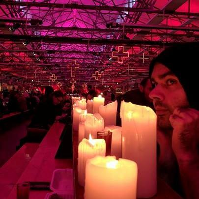
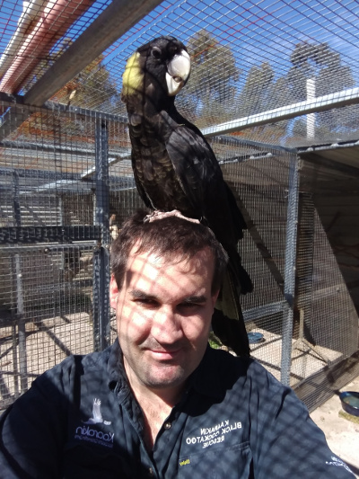
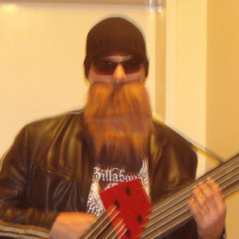
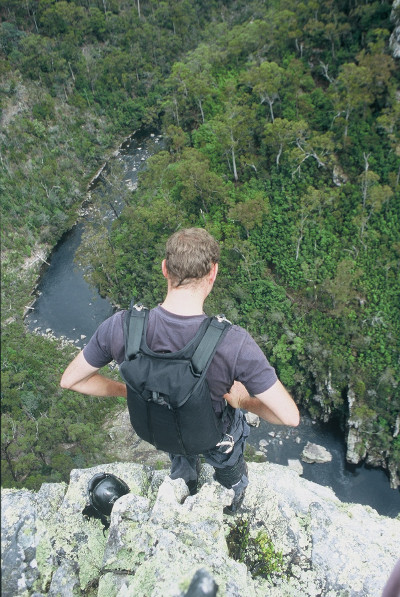
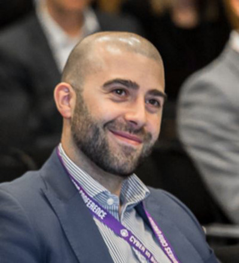
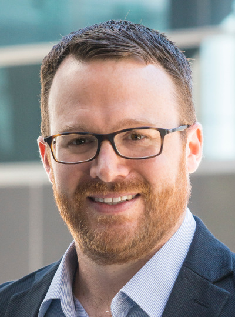
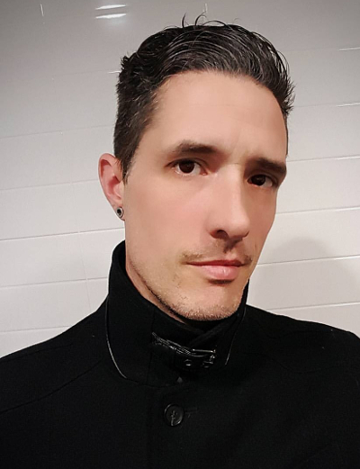

Get to know our speakers in no particular order!

*** 
## Matt Jones
 

A partner at [@elttam](https://www.elttam.com.au/), Matt has over a decade of industry experience in both offensive and defensive roles.
He enjoys problem solving, data-based analysis, and trying to come up with ways to incorporate whisky into cooking.

### Presentation
[A historical analysis of the security maturity of OpenSSH](https://bsidesperth.com.au/talks#a-historical-analysis-of-the-security-maturity-of-openssh)

***
## Mitch Kelly aka Evilmonkey

Mitch is an InfoSec and Radio Communications engineer with Vast experience in IT Security, Radio Communications, RF, Software Defined radio and Jamming. He is from Perth Western Australia and has a nack for all things blinky, shiny and things that emit RF.

### Presentation
[433Mhz And the World An Introduction to Jamming](https://bsidesperth.com.au/talks#433mhz-and-the-world-an-introduction-to-jamming)

***
## Fergal Conner & Gordon Erasmos

Fergal & Gordon are recognised thought leaders and pivotal members of the information security community. Since their debut talk at [WAHCKon \[0\]](http://wahckon.org.au/) they have engaged with the community to inform, guide, and foster development of capability within the spheres cyber security. They claim joint credit for all advancement within the field since its inception.

### Presentation
[Synergising The Internet of Everything And Fog Computing To Actualise The Cyber Perl Harbor: A Cross-silo Byod Approach to Dynamically Mitigating Next-Generation Watering Holes](https://bsidesperth.com.au/talks#synergising-the-internet-of-everything-and-fog-computing-to-actualise-the-cyber-perl-harbor-a-cross-silo-byod-approach-to-dynamically-mitigating-next-generation-watering-holes)

***
## Adam Foster aka Evildaemond

Adam Foster (evildaemond) is a Cyber Security undergrad at Edith Cowan University with a massive draw towards Physical Security, Well known collector of random junk, that he will eventually get around to messing with, and hopeful security researcher.

### Presentation
[Bypass Techniques, because I am lazy](https://bsidesperth.com.au/talks#bypass-techniques-because-i-am-lazy)

***
## Peter Yorke aka Sneaky

Sneaky (@pete12601) is an Information Security Manager @ Kinetic IT. Prior to this he was a Police Sergeant at Technology Crime Services, WA Police's specialist squad charged with investigating technology enabled crime. He is also a co-organiser of BSides Perth.

### Presentation
[The snake that took down a child exploitation ring](https://bsidesperth.com.au/talks#the-snake-that-took-down-a-child-exploitation-ring)

***
## Alex Heidenreich

Alex has more than 20 years’ experience within Defence ICT, primarily serving as a Special Forces officer within the Special Air Service Regiment.​ ​Alex led teams of Special Forces ICT specialists to develop, secure and deploy a complex and diverse array of high-readiness global telecommunications systems, capable of high-reliability communication within extreme Information Security threat environments.​
Alex developed and employed offensive and defensive cyber security capabilities in support of complex, high risk and strategically-sensitive Special Operation activities within both global and domestic contexts. Alex is an executive director and co-founder of Diamond Cyber Security.

### Presentation
[Full Mission Profiles – Intelligence-lead, scenario bound penetration testing](https://bsidesperth.com.au/talks#full-mission-profiles--intelligence-lead-scenario-bound-penetration-testing)

***
## Duncan Blandford aka Axelodtl

Axelodtl is a mature age cyber security student at ECU with a background in teaching sports people to sports better.  His dream is to live in a world where people love their work, and where excellence is the new normal.

### Presentation
[Becoming Securicon Valley: A Proposal for a State-wide Development Framework](https://bsidesperth.com.au/talks#becoming-securicon-valley-a-proposal-for-a-state-wide-development-framework)

***
## Ricki Burke

Ricki Burke is the founder of CyberSec People. With 10 years recruitment industry experience, he was fed up with the way standard recruitment was disconnected to both the people and skills required for proper placement within an organisation. As such, Ricki set up his own company. He supports organisations across ANZ and has strong ties to his local Melbourne InfoSec community, and often supports meetups, events and students on their journey to working within the industry.

### Presentation
[The cyber security "skills shortage" and what does it mean for you](../talks#the-cyber-security-skills-shortage-and-what-does-it-mean-for-you)

*** 
## Chester Wisniewski
 

Chester is a Principal Research Scientist in the Office of the CTO at Sophos in Vancouver, Canada. His primary role is to perform research on how the threat landscape is changing and provide advice to customers and the public on how to adjust policy and tactics to keep pace with the criminals.

### Presentation
[Deep Dive on the Dark Web](https://bsidesperth.com.au/talks#deep-dive-on-the-dark-web)

***
## Aaron

Aaron hires people way smarter than he is and watches them do great things. He also spends his days promoting business excellence, building knowledge scaffolds and jackknifing off burning platforms into untapped data lakes.

### Presentation
[117 projects later...](https://bsidesperth.com.au/talks#117-projects-later)

***
## Ospray

Ospray is a recent OSCP and long time infosec enthusiast. In his spare time Ospray loves researching new and emerging vulnerabilities and threats.

### Presentation
[In search of remote root](https://bsidesperth.com.au/talks#in-search-of-remote-root)

***
## Sajeeb Lohani

Sajeeb is a final year Software Engineering student at Monash. He's the founder of the Monash Cyber Security Club and a Penetration Tester at Hivint. He loves testing security of open source projects and teaching what he knows to others!

### Presentation
[Beauty and the Beast: Burp and its Extender](https://bsidesperth.com.au/talks#beauty-and-the-beast-burp-and-its-extender)

***
## Gareth Willis

Gareth is a long time sys admin, perenial trouble maker and security nerd, he has a special interest in tying disparate fields into InfoSec to construct a grand metanarritive.

### Presentation
[Do you even Cyber bro? Tales of InfoSec, Devops, and sobering lessons from cognitive science](https://bsidesperth.com.au/talks#do-you-even-cyber-bro-tales-of-infosec-devops-and-sobering-lessons-from-cognitive-science)

***
## Josh

Cyber Security Architect, dreamer of a better future, rider of the wall, a flame bearer for the southern factions, and just a guy that watches too much Netflix.

### Presentation
[Think like a Khan, build like a Qin.](https://bsidesperth.com.au/talks#think-like-a-khan-build-like-a-qin)

***
## Kai Frost

Kai is an IT professional with 20 years of experience in national scale networks. Apart from his usual job of shifting bits around the country at ridiculous speeds, Kai has an unhealthy interest in encryption and data security. He has spoken previously at WAhckon on VoIP security and hacking as it effects modern voice providers.

### Presentation
[Protecting your at-rest data from a surprisingly motivated adversary, or, why you're not paranoid enough about your disk encryption](https://bsidesperth.com.au/talks#protecting-your-at-rest-data-from-a-surprisingly-motivated-adversary-or-why-youre-not-paranoid-enough-about-your-disk-encryption)

***
## Sam

Sam is a penetration tester at Hivint Perth who has a particular interest in web application security. He is also one of the lead organisers for WACTF, Perth's first community driven CTF event which is being played opposite the BSides speaking theatre!

### Presentation
[Google Chrome - Your newest best friend in the field](../talks#google-chrome---your-newest-best-friend-in-the-field)

***
## Maxwell Koh

Maxwell is a penetration tester and independent security researcher based in Singapore. He had spent a decade hacking for living. His research area includes Two-Factor authentication, cryptography, forensics, and others.

### Presentation
[2FAssassin: Bypass 2FA, Stealing Private Keys, Abusing Client Certificates, Make Illegal Profits, Have Fun, and Much More.](../talks#2fassassin-bypass-2fa-stealing-private-keys-abusing-client-certificates-make-illegal-profits-have-fun-and-much-more)

---

### Contact Us

Say `Hello` at info@bsidesperth.com.au or find
us on

---


